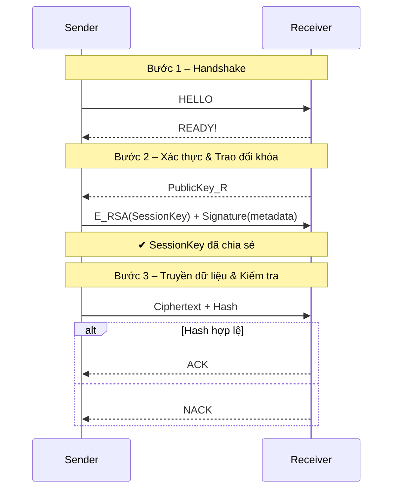

# 🚀 Ví dụ mẫu cơ bản: Mô phỏng Gửi và Nhận Dữ liệu Bảo Mật

 

## 🎯 Mục Tiêu
- **Minh họa** quy trình bảo mật file qua mạng:  
  1. Handshake  
  2. Xác thực & Trao đổi khóa  
  3. Truyền dữ liệu & Kiểm tra tính toàn vẹn
- **Thực hành** các khái niệm: Authentication, Confidentiality, Integrity.

## 🔍 Tổng Quan
Hai script Python chạy trên 2 máy riêng biệt:
- **sender.py**: Máy Gửi chịu trách nhiệm khởi tạo kết nối, xác thực và mã hóa dữ liệu.  
- **receiver.py**: Máy Nhận lắng nghe kết nối, giải mã và kiểm tra tính toàn vẹn.

## 📝 Yêu Cầu
- Python >= 3.6
- Thư viện **PyCryptodome**
- Kết nối socket TCP (cổng mặc định: 65432)

## ⚙️ Cài Đặt
```bash
# 1. Tạo virtual environment (tuỳ chọn)
python3 -m venv venv
source venv/bin/activate    # Linux/macOS
venv\Scripts\activate      # Windows

# 2. Cài đặt thư viện
pip install pycryptodome
```

## 📂 Cấu Trúc Thư Mục
```plaintext
# Máy Sender:
├─ sender.py
├─ sender_private.pem    # sinh tự động
├─ sender_public.pem     # sinh tự động
└─ email.txt             # file cần gửi

# Máy Receiver:
├─ receiver.py
├─ receiver_private.pem  # sinh tự động
└─ receiver_public.pem   # sinh tự động
``` 

## 🚀 Cách Chạy
1. **Máy Receiver** (lắng nghe kết nối):
   ```bash
   python3 receiver.py
   ```
2. **Máy Sender** (gửi dữ liệu, sau khi Receiver sẵn sàng):
   ```bash
   python3 sender.py <IP_Receiver>
   ```
3. _Theo dõi log in ra_ trên mỗi máy (delay 2s giữa các bước).

## 📋 Luồng Hoạt Động


## 🔧 Tuỳ Chỉnh & Mở Rộng
Handshake: có thể đơn giản hóa bằng CLI hoặc GUI cơ bản, ví dụ:
- CLI: người dùng nhấn Enter để gửi "HELLO", bên nhận nhấn Enter để gửi "READY!"
- GUI: hai nút "Connect" (gửi HELLO) và "Accept" (gửi READY!)

---
*Created by Nguyen Van Nhan*. *© 2025 Đại Nam University | Được phát triển bởi Khoa Công nghệ thông tin*

